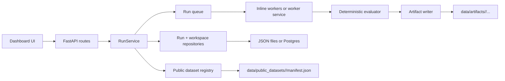

# RE-AMP: Generative Audio Robustness Evaluation

RE-AMP is a full-stack benchmark dashboard for evaluating generative audio
systems under acoustic stress, export degradation, timing shifts, and artifact
pressure. The repo is intentionally public-facing: it shows how an evaluation
platform can be structured end to end without copying private employer code.

This version goes beyond a thin demo. It now includes a FastAPI backend, a
polished single-page dashboard, queue-backed async workers, Postgres-ready
persistence, replayable benchmark jobs, scenario-level comparison, generated
waveform and spectrogram artifacts, and a public dataset registry with
downloader tooling.

[](https://render.com/deploy?repo=https://github.com/fatimmajumder/re-amp-audio-eval)

## What the project demonstrates

- benchmark orchestration with queued, running, completed, replayed, and failed
  job states
- async worker execution that can run inline for local dev or as a separate
  worker service in deployment
- deterministic evaluation logic so the same model, scenario mix, dataset, and
  seed produce stable outputs
- persistent run history plus saved workspace lanes for different evaluation
  goals, with either JSON or database-backed storage
- benchmark templates, model cards, reusable scenario library, and curated
  public dataset metadata
- generated run artifacts including a JSON report, waveform SVG, spectrogram
  SVG, WAV preview, worker log, and manifest
- side-by-side comparison across runs with scenario deltas and verdicts
- recruiter-friendly frontend that makes the evaluation story easy to inspect
- deploy-ready config for `web + worker + postgres` stacks

## Product tour

### Dashboard

The frontend at `/` includes:

- a launch form for benchmark composition with workspace and public dataset
  selection
- guided demo buttons that preload the speech red-team lane and queue a
  benchmark run in one click
- live metrics for average score, latency, best model, and active queue depth
- a public dataset registry with official source links and local-download status
- saved workspaces with persistent run counts
- a run registry with progress and replay controls
- a detail panel with scenario results, slice scores, inline media previews, and
  downloadable artifacts
- a comparison panel for completed runs
- leaderboard and recent activity sections

### API

Key routes:

- `GET /api/system` returns runtime mode, worker settings, and storage
  configuration
- `GET /api/catalog` returns benchmark templates, models, scenarios, and public
  datasets
- `GET /api/public-datasets` returns the dataset registry with local manifest
  status
- `GET /api/workspaces` lists saved workspaces
- `POST /api/workspaces` creates a new workspace
- `GET /api/overview` returns leaderboard and summary metrics
- `GET /api/runs` returns all runs in reverse chronological order
- `POST /api/runs` queues a run for worker pickup
- `GET /api/runs/{run_id}` returns full run detail
- `POST /api/runs/{run_id}/replay` re-runs the exact same scenario mix
- `POST /api/compare` compares two completed runs
- `GET /api/runs/{run_id}/artifacts/{filename}` downloads generated artifacts

## Architecture



## Repository layout

- `app/main.py` wires the FastAPI app, lifecycle, routes, and static assets
- `app/settings.py` resolves runtime configuration from environment variables
- `app/service.py` coordinates run creation, replay, comparison, overview, and
  workspace persistence
- `app/repository.py` supports both JSON-backed and SQL-backed storage
- `app/worker.py` runs the async worker loop for queued jobs
- `app/evaluation.py` scores scenarios and builds run summaries
- `app/artifacts.py` materializes report, SVG, WAV, log, and manifest files
- `app/public_datasets.py` defines the public dataset registry and local
  manifest hydration
- `app/demo_data.py` seeds benchmark templates, scenarios, model cards, and
  default workspaces
- `app/static/` contains the frontend dashboard
- `scripts/download_public_dataset.py` downloads direct-access public datasets
  for smoke tests
- `scripts/smoke_hosted_demo.py` smoke-tests a deployed app end to end
- `tests/test_api.py` covers the core API workflow
- `examples/` contains sample payloads for runs and workspaces
- `docker-compose.yml`, `Procfile`, `render.yaml`, and `render.fullstack.yaml`
  ship the deployment story

## Quickstart

```bash
python3 -m venv .venv
source .venv/bin/activate
pip install -r requirements.txt
uvicorn app.main:app --reload
```

Then open:

- dashboard: `http://127.0.0.1:8000/`
- API docs: `http://127.0.0.1:8000/docs`

By default the app seeds a few demo runs so the dashboard has data on first
load. Runtime outputs are written to:

- `data/runs.json`
- `data/workspaces.json`
- `data/artifacts/<run_id>/`
- `data/public_datasets/<dataset_id>/manifest.json`

For local dev, RE-AMP defaults to JSON-backed storage with inline workers
enabled. Queued jobs complete automatically inside the web process.

On first load, the dashboard also includes:

- `Launch guided demo run` to queue a speech robustness benchmark immediately
- `Load speech red-team lane` to preload the most compelling workspace defaults

## Production-style runtime

To switch the app into database-backed mode:

```bash
cp .env.example .env
```

Then point `DATABASE_URL` at Postgres and launch the stack with inline workers
disabled on the web service:

```bash
docker compose up --build
```

That starts:

- `postgres` for run and workspace persistence
- `web` for the FastAPI dashboard and API
- `worker` for async benchmark execution

In deployment, the worker process runs:

```bash
python scripts/run_worker.py
```

The dashboard exposes runtime details through `GET /api/system`, and the UI
shows whether the app is in JSON mode or Postgres-backed mode.

## Pull a public dataset for testing

RE-AMP now ships with official public audio dataset metadata plus a downloader
for direct-access sources. For a quick smoke test, pull a small slice of Mini
Speech Commands:

```bash
source .venv/bin/activate
python scripts/download_public_dataset.py --dataset mini_speech_commands --max-files 12
```

That writes extracted audio plus a manifest under
`data/public_datasets/mini_speech_commands/`. On the next app load the dataset
card switches from remote to downloaded and shows local sample counts.

## Run tests

```bash
python -m pytest -q
```

## Docker

```bash
docker build -t re-amp .
docker run --rm -p 8000:8000 re-amp
```

## Hosted deployment

This repo includes multiple deployment surfaces:

- `docker-compose.yml` for a local three-service stack
- `Procfile` for platforms that map `web` and `worker` process types
- `render.yaml` for the easiest public demo deployment on Render
- `render.fullstack.yaml` for a `web + worker + postgres` Render topology

### Fastest path to a public demo URL

The Deploy to Render button above uses `render.yaml`, which is intentionally set
up as a single web service:

- Docker runtime
- free web plan
- `/health` health check
- inline workers enabled
- JSON-backed storage for a lightweight portfolio demo

This is the best option when you want a public `.onrender.com` URL quickly and
don’t need durable production storage.

After Render gives you the URL, you can verify the hosted app from your machine:

```bash
python scripts/smoke_hosted_demo.py https://your-app.onrender.com
```

### Full-stack Render topology

If you want the heavier cloud setup, use `render.fullstack.yaml` instead. That
blueprint provisions:

- a web service
- a dedicated worker service
- a managed Postgres instance

For the full-stack deployment, set:

- `DATABASE_URL`
- `REAMP_STORAGE_BACKEND=database`
- `REAMP_INLINE_WORKERS=false`
- `REAMP_WORKER_COUNT=2`
- `REAMP_WORKER_POLL_INTERVAL=1.0`

Render’s Docker blueprint fields used here map cleanly to the app:

- `runtime: docker`
- `healthCheckPath: /health`
- `dockerCommand` only for the worker because the web service can use the
  `CMD` already defined in the `Dockerfile`
- `autoDeployTrigger: off` so button-based deploys don’t auto-redeploy every
  cloned instance

## Example run request

```json
{
  "benchmark_name": "audio_robustness_suite",
  "model_name": "reamp-studio-beta",
  "workspace_id": "core-audio-lab",
  "public_dataset_id": "mini_speech_commands",
  "dataset_name": "Mini Speech Commands",
  "seed": 17,
  "notes": "Candidate model under dialogue overlap and pitch drift stress.",
  "scenarios": [
    {
      "name": "speaker_overlap",
      "difficulty": "hard"
    },
    {
      "name": "pitch_drift",
      "difficulty": "medium"
    }
  ]
}
```

## Why this is portfolio-grade

This project is framed the way strong ML infrastructure work is framed in real
teams: not just model quality, but observability, repeatability, dataset ops,
decision support. It connects backend orchestration, worker design,
database-backed persistence, public-data ingestion, reporting, and frontend
presentation in one coherent story.