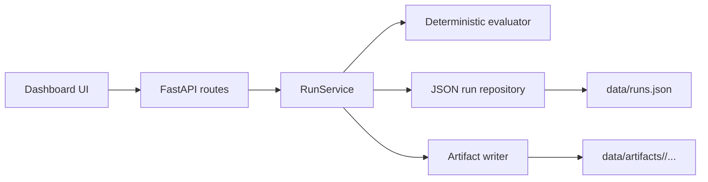

# RE-AMP: Generative Audio Robustness Evaluation

RE-AMP is a full-stack benchmark dashboard for evaluating generative audio
systems under acoustic stress, export degradation, timing shifts, and artifact
pressure. The repo is intentionally designed as a public-facing portfolio
project: it shows how an evaluation platform can be structured end to end,
without copying private employer code.

The app ships with a FastAPI backend, a polished single-page dashboard,
persistent run storage, replayable benchmark jobs, scenario-level comparison,
and generated artifact files you can open directly from the UI.

## What the project demonstrates

- benchmark orchestration with queued, running, completed, replayed, and failed
  job states
- deterministic evaluation logic so the same model, scenario mix, and seed
  produce stable outputs
- benchmark templates, seeded model cards, and a reusable scenario library
- persistent JSON-backed run history for local demos
- generated run artifacts including a JSON report, SVG spectrogram board, worker
  log, and manifest
- side-by-side comparison across runs with scenario deltas and verdicts
- recruiter-friendly frontend that makes the evaluation story easy to inspect

## Product tour

### Dashboard

The frontend at `/` includes:

- a launch form for benchmark composition
- live metrics for average score, latency, best model, and active queue depth
- a run registry with progress and replay controls
- a detail panel with scenario results, slice scores, and downloadable artifacts
- a comparison panel for completed runs
- leaderboard and recent activity sections

### API

Key routes:

- `GET /api/catalog` returns benchmark templates, models, and scenario library
- `GET /api/overview` returns leaderboard and summary metrics
- `GET /api/runs` returns all runs in reverse chronological order
- `POST /api/runs` queues a run and executes it in a background task
- `GET /api/runs/{run_id}` returns full run detail
- `POST /api/runs/{run_id}/replay` re-runs the exact same scenario mix
- `POST /api/compare` compares two completed runs
- `GET /api/runs/{run_id}/artifacts/{filename}` downloads generated artifacts

## Architecture



## Repository layout

- `app/main.py` wires the FastAPI app, routes, and static assets
- `app/service.py` coordinates run creation, replay, comparison, and overview
- `app/evaluation.py` scores scenarios and builds run summaries
- `app/artifacts.py` materializes report, SVG, log, and manifest files
- `app/demo_data.py` seeds benchmark templates, scenarios, and model cards
- `app/static/` contains the frontend dashboard
- `tests/test_api.py` covers the core API workflow
- `examples/` contains sample payloads and responses

## Quickstart

```bash
python3 -m venv .venv
source .venv/bin/activate
pip install -r requirements.txt
uvicorn app.main:app --reload
```

Then open:

- dashboard: `http://127.0.0.1:8000/`
- API docs: `http://127.0.0.1:8000/docs`

By default the app seeds a few demo runs so the dashboard has data on first
load. Runtime outputs are written to:

- `data/runs.json`
- `data/artifacts/<run_id>/`

## Run tests

```bash
python -m pytest -q
```

## Docker

```bash
docker build -t re-amp .
docker run --rm -p 8000:8000 re-amp
```

## Example run request

```json
{
  "benchmark_name": "audio_robustness_suite",
  "model_name": "reamp-studio-beta",
  "dataset_name": "synthetic-acoustic-suite",
  "seed": 17,
  "notes": "Candidate model under dialogue overlap and pitch drift stress.",
  "scenarios": [
    {
      "name": "speaker_overlap",
      "difficulty": "hard"
    },
    {
      "name": "pitch_drift",
      "difficulty": "medium"
    }
  ]
}
```

## Why this is portfolio-grade

This project is framed the way strong ML infrastructure work is framed in real
teams: not just model quality, but observability, repeatability, and decision
support. It connects backend orchestration, evaluation design, reporting, and
frontend presentation in one coherent story.
