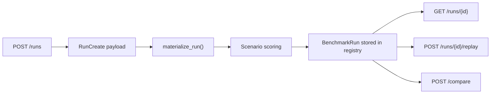

# RE-AMP: Generative Audio Robustness Evaluation

Public showcase implementation of a benchmarking system for generative audio
models.

This repo is inspired by the kind of experimentation platforms described in my
resume, but it is intentionally rebuilt as an original, public-facing demo
rather than a copy of any private company code.

## Why this project matters

I care about evaluation systems that preserve trust while teams move fast.
`RE-AMP` shows how I think about reproducibility, orchestration, run replay,
and model comparison in a way that recruiters and engineers can actually
inspect.

## What it demonstrates

- asynchronous benchmark run creation
- structured run metadata and artifact-style bookkeeping
- deterministic replay semantics
- side-by-side comparison of evaluation runs
- API-first design for a future frontend

## Stack

- Python
- FastAPI
- Pydantic
- in-memory queue and run registry abstraction
- Docker-ready local structure

## Architecture



## Repository map

- `app/main.py` exposes the FastAPI routes
- `app/schemas.py` defines the run and comparison contracts
- `app/evaluation.py` handles deterministic scoring, replay, and comparison
- `tests/test_evaluation.py` checks the public demo behavior
- `examples/` contains sample request and response payloads

## Quickstart

```bash
python -m venv .venv
source .venv/bin/activate
pip install -r requirements.txt
uvicorn app.main:app --reload
```

Then open `http://127.0.0.1:8000/docs`.

## Example request

```json
{
  "benchmark_name": "audio_robustness_suite",
  "model_name": "demo-audio-model-v1",
  "seed": 11,
  "scenarios": [
    { "name": "reverb_shift", "difficulty": "medium", "modality": "audio" },
    { "name": "background_noise", "difficulty": "hard", "modality": "audio" }
  ]
}
```

## Resume-aligned highlights

- built around reproducibility, replayability, and comparative analysis
- mirrors the structure of benchmark platforms used in serious ML evaluation
- designed to make evaluation legible instead of opaque

## Next upgrades

- persist runs to PostgreSQL instead of memory
- add background job execution for heavier benchmarks
- attach artifact manifests and richer regression slices
